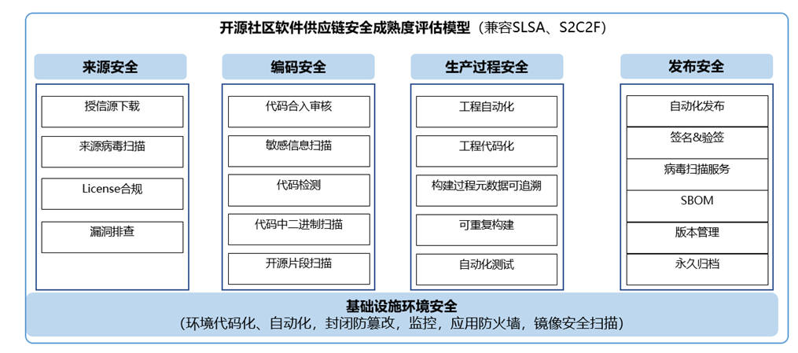

# 软件供应链安全成熟度评估模型

## 软件供应链安全成熟度整体框架:

### 软件供应链安全成熟度评估体系介绍

软件供应链安全成熟度评估体系,基于依托于整个软件开发software development lifecycle (SDLC),从

- 来源安全
- 环境安全
- 代码开发安全
- 软件生产过程安全
- 软件发布安全

5个阶段保证软件供应链安全

软件供应链安全成熟度评估等级

按照能力分为4个等级

- Level 1:软件安全交付基础:CI/CD工程自动化为基础、基础代码审核机制
- Level 2:具备初步的软件安全交付能力:授信源来源下载校验、环境与工程代码化、可追溯、基础设施基础防火墙防护
- Level 3:高级软件交付安全能力,可抵御大部分外部攻击:镜像安全扫描、漏洞排查、License合规分析、敏感信息扫描、病毒扫描、签名与验签等  
- Level 4:为软件供应链提供最高级别安全防护,能抵御复杂的外部攻击:封闭防篡改、SBOM、可重复构建

## 软件供应链安全成熟度细则:

### 来源安全

| Requirement  | Description                                                  | 度量指标           | L1   | L2   | L3   | L4   |
| ------------ | ------------------------------------------------------------ | ------------------ | ---- | ---- | ---- | ---- |
| 授信源下载   | 证明开源软件源码和制品的下载与官方指定仓库的二进制一致,可通过完整性验证hash或签名验证 | 开源软件来源可信率 |      | ✓    | ✓    | ✓    |
| 来源病毒扫描 | 构建所使用的开源软件源码和制品必须通过病毒扫描、通过后才能使用 | 病毒告警数         |      |      | ✓    | ✓    |
| License合规  | 构建所使用的开源软件源码和制品必须通过软件成分分析,保证在发布前无高风险license | 高风险license比例  |      |      | ✓    | ✓    |
| 漏洞排查     | 构建所使用的开源软件源码和制品必须通过自动化漏洞排查工具,有漏洞处理流程,保证在发布前无高危漏洞 | 高危漏洞比例       |      |      | ✓    | ✓    |
| Fuzz         | 对重点开源软件进行Fuzz测试,发现潜在漏洞、bugs                | 开源软件Fuzz比例   |      |      |      | ✓    |

### 环境安全

| Requirement    | Description                                                  | 度量指标                 | L1   | L2   | L3   | L4   |
| -------------- | ------------------------------------------------------------ | ------------------------ | ---- | ---- | ---- | ---- |
| 环境代码化     | 构建、运行时等环境代码化描述,代码纳入版本控制管理。          | 构建环境代码化率         | ○    | ✓    | ✓    | ✓    |
| 环境自动化     | 构建、运行时等环境安装自动化执行,非人工手工安装工具          | 构建环境自动化率         | ✓    | ✓    | ✓    | ✓    |
| 环境封闭防篡改 | 构建、运行环境网络可管控, 提供对外隔离的构建环境,工具安装均采用自动化脚本执行,人工无法直接破坏环境 | 构建环境封闭防篡改满足度 |      |      | ✓    | ✓    |
| 监控           | 对构建、运行环境基础设施进行硬件资源监控、网络监控、进程监控防止环境意外挂死 | 基础设施监控满足度       |      | ✓    | ✓    | ✓    |
| 应用防火墙     | 环境有防火墙保护、防止被外部攻击                             | 应用防火墙满足度         | ✓    | ✓    | ✓    | ✓    |
| 镜像安全扫描   | 对环境镜像进行安全扫描如容器镜像扫描等,防止病毒、漏洞攻击的风险 | 镜像安全扫描满足度       |      |      | ✓    | ✓    |

### 代码开发安全

| Requirement        | Description                                                  | 度量指标名称   | L1   | L2   | L3   | L4   |
| ------------------ | ------------------------------------------------------------ | -------------- | ---- | ---- | ---- | ---- |
| 代码合入审核       | 开发人员提交PR,至少有两人进行代码review后才能合入            | 代码审核率     | ✓    | ✓    | ✓    | ✓    |
| 代码中二进制扫描   | 通过自动化工具识别代码潜在的编译态的二进制,                  | 编译二进制比例 |      | ✓    | ✓    |      |
| 代码静态、动态检查 | 开发人员提交PR有自动化工具进行代码静态、动态检查,排查圈复杂度、告警密度、代码重复率、不安全函数密度、超大函数等指标,并生成自动化报告 | 代码检查满足度 | ✓    | ✓    | ✓    |      |
| 开源代码片段扫描   | 通过自动化工具扫描可疑的开源片段引用、避免合规风险           | 开源片段比例   |      |      | ✓    |      |

### 软件生产过程安全  

| Requirement    | Description                                                  | 度量指标名称     | L1   | L2   | L3   | L4   |
| -------------- | ------------------------------------------------------------ | ---------------- | ---- | ---- | ---- | ---- |
| 自动化构建     | 所有构建步骤都通过构建系统自动完成、构建执行过程中无人工干预 | 构建过程自动化率 | ✓    | ✓    | ✓    | ✓    |
| 构建工程代码化 | 构建执行过程通过脚本描述、并归档到代码仓有配置管理           | 构建工程代码化率 |      | ✓    | ✓    |      |
| 构建过程可追溯 | 构建完成后有元数据有记录(构建工程、源码、依赖、环境)等信息   | 构建可追溯率     |      |      | ✓    | ✓    |
| 可重复构建     | 相同源码、环境,两次构建的二进制比特位100%一致,例外场景除外如签名、混淆、随机数、加密等 | 构建一致性比例   |      |      |      | ✓    |
| 自动化测试     | UT、集成测试融入到CI/CD流程,看护产品质量                     | 自动化测试比例   |      |      | ✓    | ✓    |

### 软件发布安全

| Requirement      | Description                                                  | 度量指标名称         | L1   | L2   | L3   | L4   |
| ---------------- | ------------------------------------------------------------ | -------------------- | ---- | ---- | ---- | ---- |
| 发布件自动化传递 | 发布的软件包通过在线评审,自动化的平台发布,过程中无人工手动干预破坏软件包的完整性 | 发布件自动化传递比例 | ✓    | ✓    | ✓    | ✓    |
| 版本管理         | 对外发布的软件有平台进行版本控制与管理,有明确的版本发布规范  | 版本管理满足度       |      | ✓    | ✓    | ✓    |
| 永久归档         | 对发布的软件包进行持久化归档,有备份机制,防止软件包由于外界不可控因素被破坏或删除 | 永久归档满足度       |      |      | ✓    | ✓    |
| 签名与验签       | 发布的软件包经过数字签名,支持下游伙伴下载自动化验签          | 签名比例             |      |      | ✓    | ✓    |
| 病毒扫描         | 使用第三方病毒扫描工具进行扫描,保证发布软件无病毒            | 病毒告警数           |      |      | ✓    | ✓    |
| SBOM             | 软件物料清单通过CI/CD流水线自动生成,并随软件制品一起发布     | SBOM发布满足度       |      |      |      | ✓    |