# 供应链安全工具链

## 完整性保护:社区作业活动E2E防篡改/恶意软件/仿冒,保证软件供应链安全 

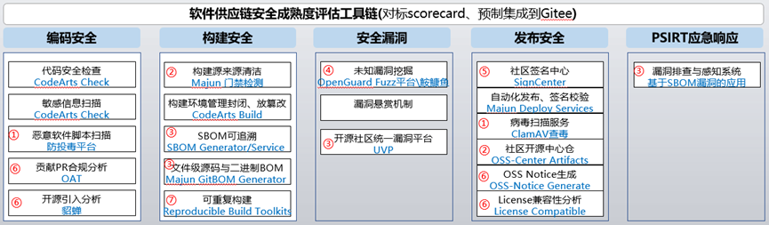

目标:实现开源社区软件来源清洁、完整性校验100%,环境封闭防篡改、过程可追溯100%,结果可重复>98%领先社区,恶意软件扫描问题清零

策略:落地来源清洁扫描门禁、哈希校验/签名验签、完成可重复构建工具链推动上游社区整改、外溢华为CloudBuild与恶意软件扫描服务

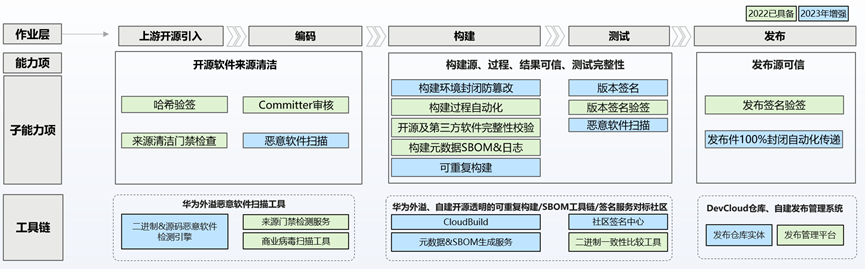

## 恶意软件扫描:增强防投毒平台,新增AI智能化检测等引擎,新增Go/Rust语言支持,2023年挑战1000+投毒样本 

目标:

1. 防投毒:增加语言支持(Go、Rust),增加引擎支持(patch投毒检测),样本量增加到5000+,投毒特征比对规则增加20%,投毒样本检测量挑战1000+

2. 病毒扫描:引入ClamAV,发布流程内嵌病毒防护能力,弥补社区没有商用杀毒软件的缺口

   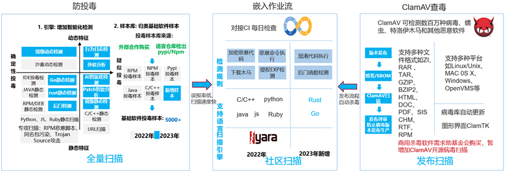

## 开源中心仓库:保障上游软件供应链安全、连续,构建使用与发布包一致 

校验失败场景:篡改风险、手动上传源码包、Source指定url地址404等;其他厂商也有建,我们用git管理tar源码包

构建开源中心仓:避免人工上传、上游链接失效等,托管源码二进制压缩包,src-openeuler仓中只存在spec、yaml、patch等文本文件

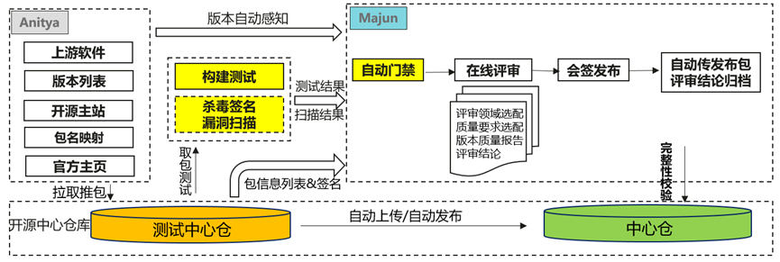

## SBOM服务为开源社区软件供应链安全保驾护航

在openEuler、OpenHarmony、MindSpore、openGauss四大开源社区应用,社区开源合规分析、漏洞分钟级排查能力

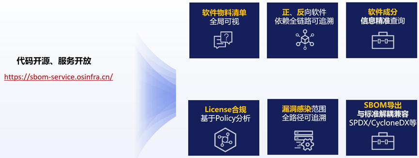

## 目标:

1. GitBOM:建立每个源码文件和二进制的追溯关系Dependency Graphs

2. VEX: 制定标准数据交换格式,基于SBOM、GitBOM、OBOM套件快速排查漏洞影响,并生成VEX漏洞影响分析报告

3. OSV Schema:使用统一OpenSSF漏洞数据交换格式,聚合多漏洞源,补齐漏洞库完备性 

4. 多SBOM协议支持:在已支持SPDX基础上,支持CycloneDX、SWID等业界通用协议,同时支持国内新发布的SBOM协议

5. SBOM防篡改:DevCloud构建元数据与SBOM卷积,记录构建过程;SBOM交付件完整性签名、验签

   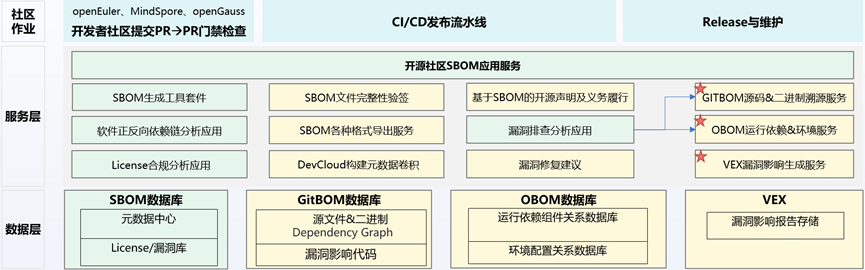

## 统一漏洞平台:“统一OpenSSF漏洞数据交换格式”,聚合多漏洞源

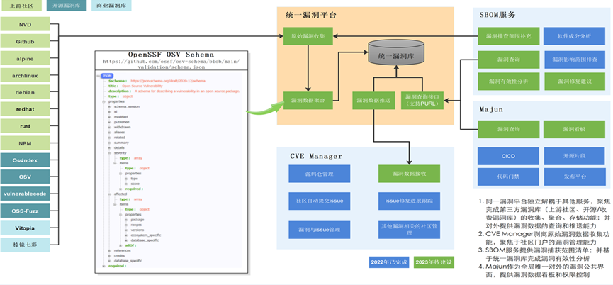

## OpenGuard Fuzz:对标Google oss-fuzz,打造国内生态标杆,发掘社区软件与上游软件漏洞

目标:建立OpenGuard Fuzz品牌,作为社区基础设施,对标oss-fuzz,提前发掘社区使用到的开源软件漏洞,补齐漏洞挖掘能力。

1. 质量目标:持续Fuzz,在保证数量不降低的前提下(60+),提高质量,Q1级软件漏洞占有量提高1倍 

2. 技术目标:研发先进的漏洞挖掘技术,挖掘危害高、影响大、隐藏深的漏洞,瞄准内核层,提升对上游社区的影响力

   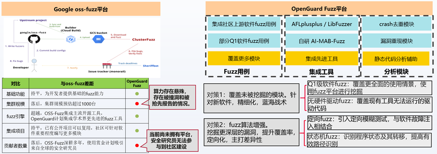

## 数字签名中心:支持开源社区证书安全保存、安全启动签名、完整性保护签名

目标:

1. 统一服务:统一社区分散的签名场景,实现社区签名场景的全覆盖(ISO,EFI,KO,RPM,通用二进制文件),性能更优

2. 密钥安全:基于HSM/TEE(硬件安全模块\可信执行环境)提供安全可靠的密钥管理平台,支撑社区密钥管理更新

   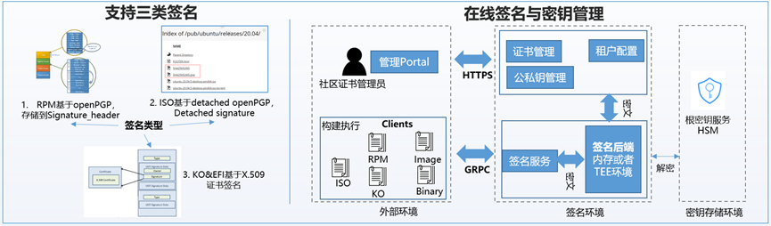

## OSS合规:构建符合ISO标准的自动化合规治理体系,保障战略级社区合规零风险

目标:遵从ISO/IEC 5230标准,21项能力除license准入清单维护与准入会审外,全部实现自动分析,支撑战略级社区全量repo合规风险清零,合规能力和治理结果全面领先标杆社区

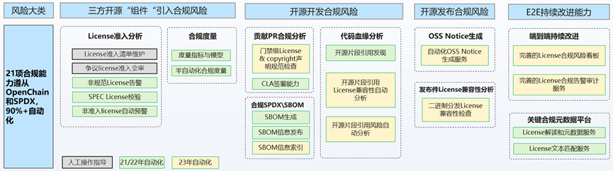

## 可重复构建:22年已建设可重复构建工具链与核心OS包可重复,23年实现领先社区Debian 95%

自建开源社区可重复构建工具链、开源开放,openEuler加入可重复构建上游社区,能力已具备,复制到openGauss、MindSpore、OpenHarmony

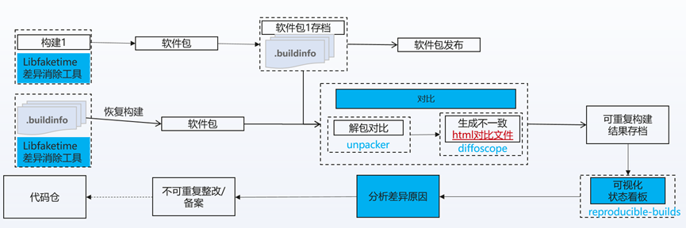