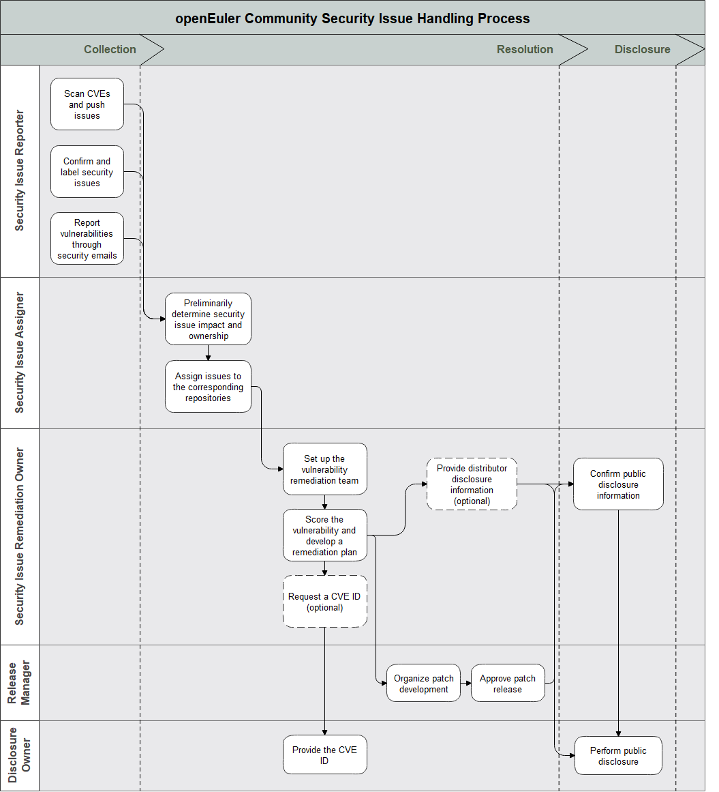

# Security Handling Process

The openEuler community adopts the security disclosure and response strategy described in this document to ensure that security issues are handled in a timely manner.

Contents

- [Security Handling Process](#security-handling-process)
  - [Security Committee (SC)](#security-committee-sc)
    - [Mission and Responsibilities](#mission-and-responsibilities)
    - [Member Management](#member-management)
      - [Joining the SC](#joining-the-sc)
      - [Leaving the SC](#leaving-the-sc)
    - [Role Description](#role-description)
  - [Security Issue Handling and Disclosure Process](#security-issue-handling-and-disclosure-process)
    - [Security Issue Collection](#1-security-issue-collection)
      - [Routine CVE Scanning](#routine-cve-scanning)
      - [Internal Reporting](#internal-reporting)
      - [External Reporting](#external-reporting)
    - [Security Issue Confirmation](#2-security-issue-confirmation)
    - [Setting Up a Remediation Team](#3-setting-up-a-remediation-team)
    - [Developing a Remediation Plan](#4-developing-a-remediation-plan)
      - [Security Issue Impact Assessment](#security-issue-impact-assessment)
      - [Security Issue Response Description](#security-issue-response-description)
    - [Organizing Patch Development](#5-organizing-patch-development)
    - [Remediation Disclosure](#6-remediation-disclosure)
    - [Remediation Process Review](#7-remediation-process-review)
  - [Security Issue Handling and Disclosure Process](#security-issue-handling-and-disclosure-process-1)
  - [Distributor List](#distributor-list)

## Security Committee (SC)

The SC is responsible for security issue response in the entire community, including internal communication and public disclosure. The entire process needs to be completed with the assistance of related developers and release managers. The SC consists of volunteers who have subscribed to the [openEuler security mailing list (private)](openeuler-security@openeuler.org).

### Mission and Responsibilities

For details about responsibilities of the SC, see [README](README-en.md).

### Member Management

- Members should be proactive.

- Members who take extended leave of one month or more should coordinate with other members to ensure that the role is staffed adequately during the leave.

- A temporary substitute should be selected for a member who takes a leave of one to three months.

- A role member can call for removal of a member who is absent without asking for leave and cannot be reached for more than one month or who has not fulfilled the written responsibilities for more than one month. The removal decision should be made according to the [supermajority rule](https://en.wikipeedia.org/wiki/Supermajority#Two-third_vote).

  

#### Joining the SC

- Generally, the SC consists of seven members.

- New members are usually nominated from the technical committee, release managers, patch release managers, and core members responsible for security in the SIGs.

- New members are decided by vote based on [lazy consensus](https://openoffice.apache.org/docs/governance/lazyConsensus.html).

- New SC members will serve as associate members for at least three months to get familiarized with the responsibilities and work process.

#### Leaving the SC

A member may leave the SC at any time. A qualified associate member will be selected to fill the vacancy. If a vote is required when a member is leaving, the vote will be conducted according to the [supermajority rule](https://en.wikipeedia.org/wiki/Supermajority#Two-third_vote).

### Role Description

The security handling process involves multiple phases and different responsibilities. SC members are assigned with specific roles to undertake the responsibilities of each phase. The following describes each role. Roles are rotated periodically to ensure that each member understands the security handling mechanism of the openEuler community.

**Remediation Owner**

Tracks and coordinates each security issue throughout its lifecycle.

**Issue Assigner**

- Ensures that corresponding issue assignees have been notified.

- Responds to issues that have not been confirmed as security issues.

- Helps score the security issues in openEuler products.

- If developers disagree on security issues, they can escalate the issues to the issue assigner if necessary.

  Online SC members respond to security requests in the order they are reported as issue assigners.

**Infrastructure Assurance Personnel**

Ensures that security tools for vulnerability scanning and code security compliance scanning work properly through the following activities:

- Checking whether the tools are running properly.
- Assigning and handling tool scanning results. Ensuring that issues found during vulnerability scanning are correctly assigned and new software packages are scanned and incorporated into the repositories.
- Analyzing and proposing optimization requirements for security tools.

**Discloser**

- Collects issues to be disclosed according to rules.
- Submits disclosure requests to the SC, including security advisories and security issues.
- Publishes related information that complies with the disclosure principles, including disclosure information, upgrade documents, log changes, severity explanation, error notifications sent to mailing lists, and CVE requests.

**Security Contact**

This role is not a member of the SC, but a role in each SIG designated for security activities. This role should be taken by SIG members who want to join the SC in the future. This role is responsible for:

+ Preferentially handling security issues assigned to the SIG.
+ Providing security issue disclosure information about the projects in the SIG.
+ Assisting in non-public security activities, such as security process improvement, incentive management, code review.

**Release Team**

The security patch release team is a part of the [release management SIG](https://gitee.com/openeuler/community/tree/master/sig/sig-release-management). The team is responsible for the following activities in the security process:

- Managing and refreshing the [Distributor List](private-distributors-list.md).

+ Organizing maintainers in the related SIGs when security fixes are required, managing builds, and releasing patches.

**Release managers** are responsible for organizing related activities throughout the security issue lifecycle in compliance with the process requirements for handling and disclosing security issues.

## Security Issue Handling and Disclosure Process

### 1. Security Issue Collection

####  Routine CVE Scanning

- The openEuler community uses vulnerability scanning tools to routinely scan and synchronize disclosed vulnerabilities in the upstream community software packages imported to openEuler.
- Issues will be pushed to the corresponding SIGs with CVE labels attached based on the [openEuler Security Process Email Templates](template-security-bug.md).

#### Internal Reporting

If a bug in a SIG is confirmed as a security vulnerability by the security team, a security team member will set the corresponding issue as private, add the security issue label, and add a priority label as required. Security issue assigners will regularly check the updates of such issues.

####  External Reporting

If you know a security vulnerability that is not in the list of public security vulnerabilities resolved by the openEuler security team, please send an email to <openeuler-security@openeuler.org> immediately to notify the SC so that they can start the patch, release, and advisory processes.

Use the [openEuler Security Process Email Template](template-security-bug.md) when sending the email. You can also use a PGP public key requested from a member of the [openEuler Security Committee](README-en.md) to encrypt the email. After receiving the report email, the security issue assigner will create a security issue in the repository.

If necessary, the SC will ask for your consent to disclose the issue confidentially through the person in charge. If you do not agree, we will disclose the issue publicly.

### 2. Security Issue Confirmation

Security issue assigners will confirm new issues, including:

- Determining the affected projects and software packages for externally reported security issues.
- Contacting engineers (preferentially selected from maintainers and committers of related projects) to confirm whether an externally reported issue or CVE issue is a new security issue. After confirmation, assigning the private issues to corresponding repositories.
- Notifying the issue reporters after confirmation for externally reported security issues.

Security issue assigners record the confirmation in the issue handling progress, and change the issue status to start the resolution process.

### 3. Setting Up a Remediation Team

The remediation owner will set up a remediation team, which includes:

- Release manager of the corresponding version or patch.

- SIG members of the affected projects, preferably those who have participated in assignment of the issue (specified in the corresponding **OWNERS** file).

### 4. Developing a Remediation Plan

For each vulnerability, the remediation owner coordinates with the remediation team and release manager and sends emails to relevant community members. The remediation owner makes a remediation plan based on the severity of the issue, the time required for development, and the version release plan provided by the release manager.

#### Security Issue Impact Assessment

The remediation owner and the remediation team will score a vulnerability using the [CVSS Calculator](https://www.first.org/cvss/specification-document#i5). They will determine the impact and severity of the issue based on [Vulnerability Severity Assessment](https://www.openeuler.org/en/security/vulnerability-reporting/). The remediation owner makes a final assessment of the risk.

- If the assessment score is lower than 4.0 (low severity) or the assessed risk is low, the remediation owner can choose to fix the issue in a half-open manner. This means that PRs are submitted directly to public openEuler repositories and the issue can be discussed in public channels. The remediation team can also slow down the release process under certain circumstances, such as holidays. These decisions must be discussed at security meetings.

- If the assessment score is lower than 6.0 and higher than 4.0 (medium severity), the remediation owner can also choose to fix the issue in a half-open manner. The remediation owner will confirm whether fixing the issue publicly will harm users and decide whether to limit the discussion of security details of the issue to private channels.

Note: The remediation owner has the right to set the severity of a vulnerability.

#### Security Issue Response Description

- If a security issue is caused by an openEuler community project, the remediation schedule will be developed as soon as possible.
- If not, the remediation procedure will be dependent on the disclosure schedule of the upstream community. The remediation owner will cooperate with the upstream community to protect the security of openEuler users to the maximum extent while adapting to the schedule of the upstream community.

### 5. Organizing Patch Development

+ If a patch is to be developed in a private secure repository, the remediation owner will grant permissions to the remediation team for accessing the private secure repository in openEulerXXXXXX.
+ The remediation owner will request a CVE ID from a CVE numbering authority. This process is not required for CVEs disclosed by upstream communities.
+ The release manager organizes patch development based on the release plan.
+ If related patch files in the private repository are submitted to the software package repository of the corresponding version, or the publicly fixed software package is submitted to the corresponding software package repository, the release manager will notify the remediation owner that the remediation has been completed.

Note: The openEuler private secure repository is owned by the SC. The organization is managed by the infrastructure SIG.

### 6. Remediation Disclosure

As the remediation progresses, the remediation owner needs to submit an overall communication plan to a wide extent in the community. The overall communication should be initiated after the remediation team developed the remediation or mitigation measures so that an achievable plan can be communicated to users.

**Distributor Disclosure (optional)** (1 to 14 days after issue confirmation)

+ The remediation owner determines whether to inform the distributors of a serious issue as soon as possible, for example, a vulnerability that is remotely exploitable or involves privilege escalation. The decision will be made under the assistance of the remediation team. This step can be skipped for relatively minor issues.
+ The remediation owner sends the patch to <distributors-announce@openEuler.org> by email so that the distributors can prepare the patch in advance and deliver it to users on the release date. Distributors should subscribe to the [Distributor Disclosure Mailing List](distributors-announce@openEuler.org) and read the [Distributor Disclosure Notes](private-distributors-list.md) to learn about the requirements for joining the mailing list.

**Remediation Release Date** (1 to 21 days after issue confirmation)

+ [Distributors](private-distributors-list.md) shall be notified by email at least 24 hours in advance of an upcoming release. The notification shall contain the advisory message and the date of advisory.
+ The remediation owner pushes the patch to the master branch and related distribution branches. The remediation team will use the **/lgtm** and **/approve** labels to approve the PRs.
+ The release manager will merge the PRs as soon as possible. The commits should remain unchanged after the PRs are created to avoid conflicts with the patch sent to the distributors and conflicts when applying the patch to the branches.
+ The release manager should ensure that all binary files can be built, run properly, and are ready for public use.
+ The remediation owner will provide the disclosure owner with the new version number, CVE ID (if needed), severity and impact, and location of the binary files to support wider distribution and user actions. The disclosure owner will update the advisory to the community website as soon as possible and include any mitigation that users can take before upgrading to a fixed version. Advisories will be sent through the following channels:
  + <openeuler-security@openeuler.org>
  + <distributors-announce@openeuler.org>
  + [Security Advisories](https://www.openeuler.org/en/security/safety-bulletin/)
  +  Issues labeled with **area/security** and prefixed with the CVE IDs at <https://gitee.com/openeuler/issues>
  
+ If applicable, the remediation owner will remove the remediation team from the private secure repository.

### 7. Remediation Process Review

The following steps should be completed one to three days after the remediation release. The review process is a driving force for improvement.

+ The remediation owner sends the issue review process to <security-discuss-private@openeuler.org>, including detailed information about each participant, execution details of the process schedule, PRs associated with the issue, and any actions or suggestions for the response and release.
+ Release managers and remediation teams are encouraged to send their feedback to <security-discuss-private@openeuler.org>. Honest criticism is an important method for improving our community.

## Security Issue Handling and Disclosure Process

## Distributor List

This list is used to provide security-related actionable information for openEuler distributors. For details, see the [Distributor List](private-distributors-list.md).
