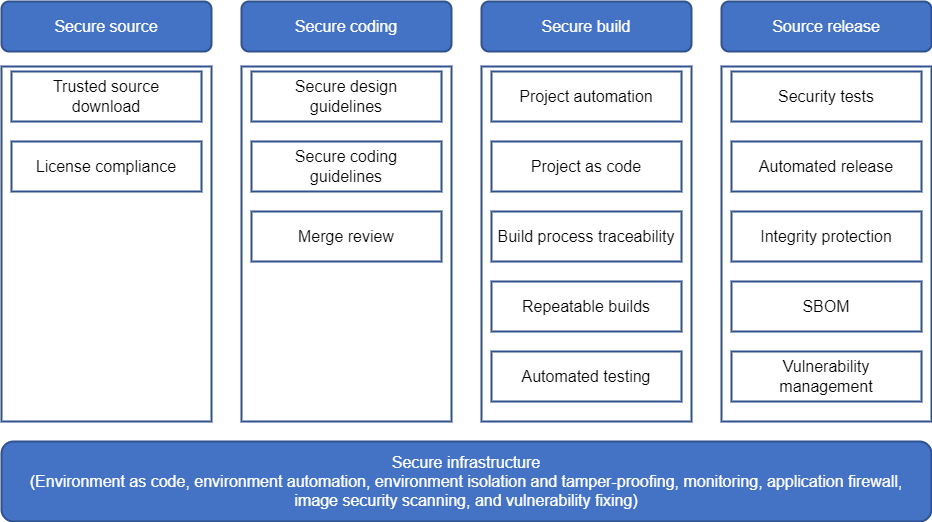
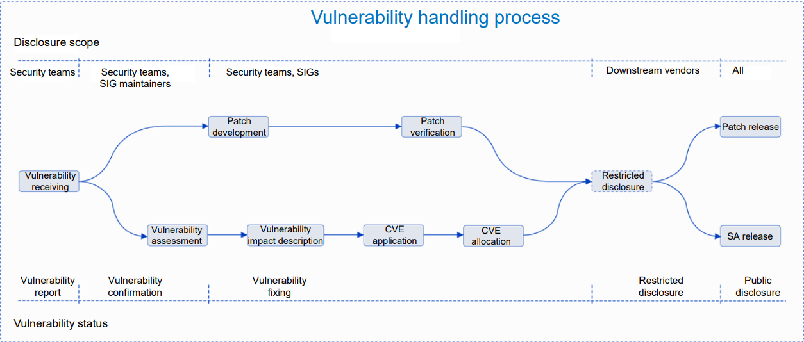

# openEuler Community Security Assurance Policy Outline

## 1 Overview

This document, the openEuler Community Security Assurance Policy Outline, serves as the guiding principle for security governance within the openEuler community. It aims to enhance the security and compliance of the openEuler community and drive continuous improvement in its security capabilities by systematically establishing a community supply chain security system that ensures the security of openEuler versions. This policy outlines the overall objectives, scope, development procedures, guidelines, and release strategies for community security requirements. It also defines the construction approach, overall architecture, and content structure of the key components of these requirements.

## 2 Objectives

- Establish a comprehensive set of community security requirements to systematically support openEuler community versions and development processes. These requirements will ensure **compliance with external regulations and standards and incorporation of industry best practices**.
- Formulate these requirements by analyzing the demands of key stakeholders and the work content of core roles. This multifaceted approach will ensure **content comprehensiveness**.
- Guarantee the **effectiveness of implementation** by considering the feasibility, enforceability, and verifiability of the content.
- Establish a robust mechanism to update the content in a **structured and timely manner** based on external input and internal feedback.

## 3 Scope

The community security assurance requirements primarily focus on solidifying mature and universal knowledge, experience, and best practices in the field of security engineering from the perspective of community developers and product suppliers. The scope includes, but is not limited to:

- Defining security requirements, implementation details, and implementation guidelines. This standardizes and regulates the security engineering deliverables and behaviors of products and teams, ensuring they are repeatable and predictable.
- Providing verification methods and recommending verification tools to assess the effectiveness of security engineering specification implementation.

## 4 Framework

The community security assurance requirements align with industry-standard maturity evaluation systems for the security of open source software supply chains, covering the entire software development lifecycle (SDLC). They focus on five stages to ensure software supply chain security: secure source, secure infrastructure environment, secure coding, secure build, and secure release.

## 5 Secure Source Requirements

The openEuler community is committed to creating an open operating system. We encourage participation from individuals and organizations to contribute to the openEuler community. This participation must comply with licenses, export controls, and other relevant laws. Secure source requirements are in place to ensure the security of open source software introduced into the community.

To maintain and manage the software lifecycle, evidence-based trust is integrated throughout the selection process. Every step in software package introduction is meticulously documented, and these records serve as proof of a trustworthy process.

Software selection and pre-introduction checklist

| Checkpoint     | Description                                                                                                                            | Category      |
|----------------|-------------------------------------------------------------------------------------------------------------------------------------|---------------|
| Package information | The official  download address of the source code package must be provided for traceability.                                                       | Pre-introduction checklist |
| License check   | The licensing status of software to be introduced must be verified, ensuring consistency between the license information provided during introduction and that on the official website and in the software package. Caution should be exercised when open source software with high-risk licenses is introduced. | Code gated check-in      |

## 6 Secure Infrastructure Environment Requirements

### 6.1 Environment as Code

Environment as code ensures consistent best practices during the build process, supporting a repeatable and maintainable environment. Specific requirements are as follows:

- Maintain build environments through container or virtual machine (VM) images.
- Prohibit environment dependencies from being updated during runtime.
- Manage build scripts, such as Dockerfiles, through code repositories.
- Review and approve environment script updates with at least two reviewers.
- Provide comprehensive guidelines detailing the environment build process.

### 6.2 Environment Automation

Automating the build environment enhances efficiency, reduces errors, and ensures consistency and maintainability. Specific requirements are as follows:

- Employ appropriate tools for environment build and deployment, such as Kubernetes, Docker, Terraform, and Ansible.
- Develop scripts for automated environment build, configuration, and deployment.
- Configure continuous integration and continuous delivery (CI/CD) pipelines to achieve automated build, testing, and deployment.
- Utilize environment variables to manage sensitive information and configurations, ensuring security and configurability.

### 6.3 Environment Isolation and Tamper-Proofing

Environment isolation and tamper-proofing guarantee that the build environment is isolated and secure during runtime, effectively preventing tampering. Specific requirements are as follows:

- Isolate the environment within a private network, restricting access to external networks. Alternatively, implement an allowlist to limit the scope of accessible resources.
- Grant services the minimum necessary permissions, avoiding excessive privileges.
- Configure detailed audit logs to record operations and events on the environment, facilitating tracking and investigation.
- Utilize tools to monitor the integrity of environment files and configurations, detecting any unauthorized changes.

### 6.4 Monitoring

Monitoring provides an effective strategy and best practices to ensure system stability and reliability during runtime, enabling timely responses to potential issues. Specific requirements are as follows:

- Select industry-standard monitoring tools for comprehensive and real-time monitoring of system performance and status, such as Prometheus, Grafana, ELK stack, and monitoring solutions from public cloud providers.
- Utilize centralized log storage for log monitoring to facilitate retrieval and analysis. Generate structured logs within applications to simplify analysis.
- Monitor system-level metrics such as node CPU usage, memory usage, drive space, and network traffic, as well as key application metrics like response time, throughput, and error rate.
- Set appropriate thresholds for each key performance metrics and trigger alerts when thresholds are exceeded.
- Regularly review and optimize alert rules to ensure they are relevant and actionable.

### 6.5 Web Application Firewall

A web application firewall (WAF) strengthens application security and protects against attacks targeting common web applications. Specific requirements are as follows:

- Determine the protection scope by identifying critical applications and services and defining the WAF protection boundaries, including the network architecture and application framework.
- Configuring protection rules based on application characteristics to identify and prevent various types of attacks.
- Regularly review and validate WAF rules to ensure they remain up-to-date and adapt to new threats and attack patterns.
- Integrate with a security operation platform for real-time log monitoring to detect and respond to potential security events promptly.

### 6.6 Image Security Scanning

Image security scanning is crucial for ensuring container image security and mitigating potential vulnerabilities. Specific requirements are as follows:

- Utilize industry-standard security scanning engines such as Trivy, Clair, and Aqua Security.
- Integrate image scanning into the CI/CD pipeline to ensure security scans are performed during updates.
- Conduct regular image security scans and ensure timely updates to base images and dependencies.
- Use the same openEuler LTS image as the base image to ensure dependency consistency and timely vulnerability updates.

## 7 Secure Coding Requirements

- The openEuler community publishes secure design guidelines and C/C++ secure coding guidelines to guide community project development.
- Code pull requests (PRs) submitted by developers require review and merge approval from at least one maintainer or committer. Developers are prohibited from merging their own PRs directly.

## 8 Secure Production Process Requirements

Deliverables of openEuler community versions come in various formats, including RPM packages, ISO images, container images, and VM images. The production of these different formats relies on a RPM build system. The openEuler community is responsible for ensuring the security of the build process, from source code to RPM packages and other image files.

### 8.1 Automated Build Requirements

- Manual or scheduled build triggering: Community build tasks support full builds, incremental builds, and single-package builds to meet diverse needs. These tasks are triggered manually by build engineers or through scheduled tasks. Manual intervention is prohibited in this process.
- Automatic single-package build task arrangement: Upon creation of full or incremental daily build tasks, the build system automatically parses and decomposes them into single-package build tasks. It then arranges the task consumption order, automatically schedules and dispatches them to build machines. Manual intervention is prohibited in this process.
- Automated build environment preparation: The build system automatically prepares the build environment on the build machines for newly dispatched tasks. Manual intervention is prohibited in this process.
- Automated single-package build: The system automatically executes single-package build tasks, encompassing compilation, testing, packaging, and upload. This process is self-contained and does not permit manual intervention.
- Automated RPM package archiving: The build system automatically archives the RPM packages generated during the build process. Manual intervention is prohibited in this process.
- Automated signing and repository publishing: Upon completion of all single-package build tasks, the build system automatically signs the RPM packages and publishes them to a designated project repository (with a unique address). The completion of the daily build task signifies that the repository is updated and available. Manual intervention is prohibited in this process.
- ISO image creation: ISO image creation tasks are triggered manually or through scheduled tasks. Upon completion, the ISO images are automatically archived to the designated server. Manual intervention is prohibited in this process.

### 8.2 Build Process as Code

The community build system, from build task creation to repository update, is executed and controlled entirely by code. This code is managed within community code repositories. Any code modification be submitted as a PR process for merging.

### 8.3 Build Process Traceability

The community build system automatically records key metadata after the completion of build tasks. This metadata includes, but is not limited to:

- Build project address
- Build software repository: Git address, branch, and commit ID
- Build environment image ID
- List of dependencies installed in the build environment, including version information

All metadata is made publicly accessible, ensuring transparency and traceability.

### 8.4 Repeatable Builds

The community build system ensures repeatable software package builds. This means that under identical source code and build environment conditions, two builds will result in identical binary files, except for specific cases like signing, obfuscation, random numbers, and encryption.

### 8.5 Automated Testing

The community build system supports basic automated testing or integrates with other CI/CD platforms to provide more advanced automated testing capabilities, including:

- Automated execution of unit tests provided by software packages during build processes
- Automated signature verification and installation validation of software packages
- Automated image creation verification based on project repositories
- Automated acceptance test (AT) smoke tests

## 9 Secure Release Requirements

### 9.1 Automated Deliverable Transfer

A release deliverable requires review and approval from the Release Special Interest Group (SIG). Once the deliverable is approved, a build engineer manually triggers a task to push the release ISO, image, or RPM package to the [official repository](https://repo.openeuler.org/).

Official release servers are isolated from daily build servers.

### 9.2 Release Security Requirements

Based on community security requirements, release deliverables undergo verification for security and compliance.

- The release documentation must include a list of release deliverables. For example, 22.03 LTS SP3 [Release Files](https://docs.openeuler.org/en/docs/22.03_LTS_SP3/docs/Releasenotes/installing-the-os.html).
- Releases must meet the [Network Security Quality Requirements for Releases](guide/SecureRelease_en.md).

| Security Requirement                | LTS Versions                 | Innovation Versions Release |          |            |                |          |
|-----------------------------|-----------------------------|----------------|----------|------------|----------------|----------|
|                             | BaseOS                  | everything | EPOL | BaseOS | everything | EPOL |
| Virus scan                 | ✔                           | ✔              | ✔        | ✔          | ✔              | ✔        |
| Vulnerability scan          | ✔                           | ✘              | ✘        | ✘          | ✘              | ✘        |
| Secure compilation scan       | ✔                           | ✘              | ✘        | ✔          | ✘              | ✘        |
| Security test baseline cases | ✔                           | ✔              |          |            |                |          |
| Secure snippet reference scan        | Only for openEuler community-incubated software   |                |          |            |                |          |
| Open source software license compliance check | ✔                           | ✔              | ✔        | ✔          | ✔              | ✔        |

- Release deliverables must have a signature and integrity verification mechanism. For instance, RPM packages must have GPG verification and signatures (signing algorithms are also reviewed periodically).
- The capability to automatically generate software bill of materials (SBOM) information must be available, and SBOMs must be generated and released along with software releases.

## 10 Community Vulnerability Management

The openEuler community attaches great importance to the security of community editions and assigns vulnerability management specialists to take charge of vulnerability-related affairs.

The openEuler Security Committee has developed a vulnerability handling process and policies, including detection, confirmation and assessment, fixing, and disclosure of vulnerabilities. In addition, a project named cve-manager is created in the community to implement automatic or semi-automatic community vulnerability management. For example, the project can automatically detect vulnerabilities in upstream software, check whether the vulnerability handling process meets community requirements, and automatically generate security advisories (SAs) in Common Vulnerability Reporting Format (CVRF). The following figure shows the vulnerability handling process followed by the community.

### 10.1 Vulnerability Handling Scope

The openEuler community adopts differentiated vulnerability handling policies for different types of software packages. For software packages comprising the BaseOS of LTS releases, the vulnerability fixing rate is dominant and must be ensured. For software packages not included in the BaseOS nor LTS releases, there is no requirement on the vulnerability fixing rate.

| **Software Package Type** | **Vulnerability Detection** | **Vulnerability Fixing**                      | **Vulnerability Disclosure**  |
|----------------|--------------|-----------------------------------|---------------|
| LTS releases        | Supported        | Steer vulnerability fixing for software packages in the BaseOS to reach the SLA. | SAs and CVEs   |
| Non-LTS releases      | Supported        | Not required.                        | No SA or CVE |

### 10.2 Vulnerability Receiving

The openEuler community receives community-related vulnerabilities from multiple channels:

For disclosed vulnerabilities, detection tools or community contributors obtain vulnerability information and create CVE issues on Gitee to track vulnerability handling.

For undisclosed vulnerabilities, vulnerability management specialists of the openEuler Security Committee will reply to the vulnerability submitters within 24 hours after receiving vulnerability reports.

| **Receiving Channel**  | **Reporting Method**   | **Description**                                                         |
|--------------|----------------|----------------------------------------------------------------------|
| CVE-manager  | CVE issue      | Synchronizes vulnerabilities in upstream open source software and submits CVE issues using the **openeuler-ci-bot** account.     |
| Community contributor   | CVE issue      | Identifies vulnerabilities in upstream open source software and submits CVE issues. For details, see [How to Submit a CVE Issue](https://gitee.com/openeuler/security-committee/wikis/FAQ/How%20to%20Submit%20a%20CVE%20Issue). |
| Security researcher   | Security Committee mailbox | Reports vulnerabilities through encrypted emails. For details, see [Vulnerability Reporting](https://www.openeuler.org/en/security/vulnerability-reporting/).                                |

### 10.3 Vulnerability Assessment

All vulnerabilities tracked by the community are assessed using CVSS v3 that is widely used in the industry.

### 10.4 Vulnerability Fixing

The openEuler community uses differentiated fixing policies with specific timeframes based on the vulnerability severity to ensure rapid fixing of high-risk vulnerabilities. The Security Committee will also identify high-risk vulnerabilities based on factors such as public impact and exploitation of vulnerabilities and fix them within one to three days to reduce the risk of malicious exploitation. Vulnerability fixing is a complex task. Therefore, we do not guarantee that all vulnerabilities can be fixed within the time listed in the following table. If a vulnerability cannot be fixed (for example, unavailable upstream patches, excessive fixing difficulty, or special circumstances), the maintainer needs to notify vulnerability management specialists of the openEuler Security Committee for review or clarification as required.

| **Severity Rating**  | **CVSS Score**  | **Vulnerability Fixing Timeframe**  |
|---------------------------------|-----------------------|------------------|
| Critical                | 9.0–10.0              | 7 days              |
| High                      | 7.0–8.9               | 14 days             |
| Medium                    | 4.0–6.9               | 30 days             |
| Low                       | 0.1–3.9               | 30 days             |

### 10.5 Vulnerability Disclosure

The openEuler community discloses critical 0-day vulnerabilities only to downstream distributors in the restricted disclosure list within an embargo, and releases SAs and CVEs only after collaborative fixing.

- Public disclosure

Once a disclosed security vulnerability is fixed, vulnerability management specialists of the openEuler Security Committee and the Release SIG will jointly release an SA, which includes the technical details, CVE ID, CVSS score, severity, affected releases, and releases to fix the vulnerability. You can subscribe to SAs in the openEuler community by clicking the **sa-announce** link.

- Restricted disclosure (optional)

For undisclosed critical vulnerabilities enabling remote exploitation or privilege escalation, vulnerability fixing solutions will be provided to downstream distributors through restricted disclosure channels.

## 11 Roles and Responsibilities of Community Security Personnel

To ensure efficient operation and execution of openEuler community security activities, the Security Committee has defined several security roles and responsibilities. Individuals assuming these roles must possess security knowledge and awareness and pass the openEuler community security certification exam. These roles are rotated periodically to provide everyone with opportunities to understand and participate in the various security activities within the openEuler community. Below are definitions of each role:

- **Security specification and process specialist**
    Responsible for establishing and continuously improving the security specifications and vulnerability management processes of the openEuler community, based on best practices from open source communities and the specific circumstances of the openEuler community. This role also oversees the promotion of these specifications and processes within the community. It focuses on building capabilities in vulnerability management, code security, and infrastructure security. It also utilizes tools and automation to implement security specifications and processes.
- **Package introduction security specialist**
    Assists the package management team in carrying out security checks during software package introduction. This ensures that the introduced packages meet the community requirements. This role represents the Security Committee in providing security advice on package introduction, which includes, but is not limited to, trusted source checks, vulnerability assessments, and virus scanning.
- **Vulnerability management specialist**
    Responsible for the implementation and execution of the openEuler community vulnerability management strategies and processes. This includes building capabilities for vulnerability receiving, assessment, fixing, disclosure, and reward programs within the community. This role leverages tools and automation to improve the efficiency of vulnerability handling and uses vulnerability measurement dashboards to periodically manage the risks associated with community vulnerability handling.
- **Secure build and release specialist**
    Supports the Release team in conducting security checks before the release of openEuler LTS and innovation versions. This includes ensuring the integrity of the software package. This role also represents the Security Committee in providing security advice on version releases. The scope of security checks includes vulnerability fixing status, security testing status, and the review of security-related documentation.
- **Infrastructure security specialist**
    Works with the infrastructure team to build security tool solutions for the community. This role uses tools and automation to implement security checks, continuously enhance the capabilities of community security tool solutions, and assist community developers in quickly identifying and addressing security flaws and risks. It is responsible for building security capabilities in the entire lifecycle of the openEuler community infrastructure, including design, development, testing, release, and operation, ensuring secure and stable operation of the infrastructure.
