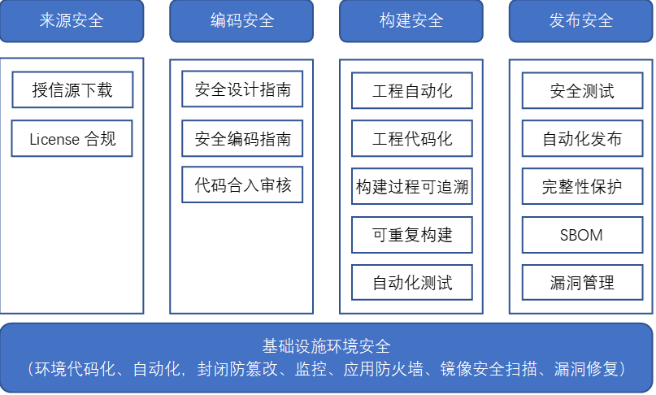

# openEuler社区安全保障策略总纲

## 1 社区安全保障策略总纲定位

&ensp;&ensp;为了更好地提升openEuler社区的安全合规性，牵引其安全能力不断提升，需系统性建立社区供应链安全体系，为openEuler版本提供安全保障。社区安全保障策略总纲作为社区安全治理的纲领性文件，用于明确社区安全保障要求的整体编制目的、范围、编制程序与准则、发布策略等，并对社区安全保障要求的建设思路、总体架构及主要组成部分的内容结构进行约定。

## 2 社区安全保障策略总纲编制目的

-   通过制定一系列的社区安全保障要求以系统化地支撑社区版本及研发过程在安全方面的**外部法规/标准要求的遵从以及业界最佳实践的提炼和融入**。
-   社区安全保障要求的编制需要结合关键利益相关方诉求、核心角色的工作内容进行多维度分析和整理，以尽可能地实现**内容的完备性**；从规范内容的可行性、可约束性、及可验证性等方面充分考虑以保障规范**落地的有效性**；建立合理的机制，根据外部输入及内部反馈**有序、及时地刷新**规范内容。

## 3 社区安全保障策略总纲的范围

&ensp;&ensp;社区安全保证要求主要从社区开发者、产品供应商视角，固化安全工程领域成熟、普适的知识、经验、业界最佳实践等。其范围主要包括但不限于：

-   指定安全要求、实现细则、实施指导等，以约束和规范化产品和团队的安全工程交付件与行为，使其可重复、可预测
-   提供验证方法、推荐验证工具以检验安全工程规范的实施效果

## 4 社区安全保障策略总纲总体框架

&ensp;&ensp;社区安全保障要求参照业界开源软件供应链安全成熟度评估体系，覆盖整个软件开发生命周期software development lifecycle (SDLC),从来源安全->环境安全->编码安->构建安全->发布安全 5个阶段来保证软件供应链安全。

## 5 来源安全保障要求

&ensp;&ensp;openEuler是一个致力于创建开放操作系统的开源组织。帮助任何人和组织，在不违反license、进出口管制或其他相关法律的前提下，参与openEuler社区贡献，同时通过来源安全保障要求确保社区选型引入的开源软件的安全。

&ensp;&ensp;为实现对软件生命周期的维护和管理，基于证据的可信贯穿于选型的整个过程。在一个软件包被引入的每一步都需要有记录，这些记录被作为可信过程的存证。

&ensp;&ensp;软件选型及引入前检查要求

| **检查点**     | **说明**                                                                                                                            | **类别**      |
|----------------|-------------------------------------------------------------------------------------------------------------------------------------|---------------|
| 软件包信息提供 | 必须提供官方提供的源代码包的下载地址，以达到可溯源                                                                                  | 引入checklist |
| license检查    | 1、待引入软件是否有license 2、入库时填写的license是否和官网保持一致；是否和软件包中license保持一致；高风险license的开源软件谨慎引入 | 代码门禁      |

## 6 基础设施环境安全保障要求

### 6.1 环境代码化

&ensp;&ensp;构建环境代码化旨在确保在构建过程中采用一致的最佳实践，以支持可重复、可维护的环境。具体要求如下:

-   构建环境通过容器/虚拟机镜像等维护
-   环境依赖不允许在运行时更新
-   构建脚本如Dockerfile等需要通过代码仓库管理
-   环境脚本更新需要通过多于1人评审通过
-   需要提供完整的指导手册介绍环境构建流程

### 6.2 环境自动化

&ensp;&ensp;构建环境自动化可以提高效率、降低错误，确保环境的一致性和可维护性，具体要求如下：

-   选择适当的工具用于环境构建和部署，如kubernetes，docker，terraform，ansible等
-   编写自动化脚本，实现环境的自动化构建、配置和部署
-   配置持续集成和持续交付流水线，实现自动化构建、测试和部署
-   使用环境变量管理敏感信息和配置，确保安全性和可配置性

### 6.3 环境封闭防篡改

&ensp;&ensp;环境封闭防篡改旨在确保构建的环境在运行时封闭、安全，并能够有效防范篡改，具体要求如下：

-   网络隔离，将环境放置在私有网络中，限制对外部网络的访问，或通过白名单限制可访问的范围。
-   最小权限原则, 给予服务最小必要的权限，避免赋予过多权限
-   日志审计, 配置详细的审计日志，记录环境的操作和事件，以便追踪和调查
-   完整性监控，使用工具监控环境文件和配置的完整性，检测任何未经授权的更改

### 6.4 监控

&ensp;&ensp;监控可以提供一套有效的监控策略和最佳实践，确保系统在运行时保持稳定、可靠，并能够及时应对潜在的问题，具体要求如下：

-   选择业界通用的监控工具，以确保能够全面、实时地监控系统的性能和状态，如Prometheus，Grafana, ELK Stack以及公有云厂商监控方案等。
-   日志监控需要使用中央化的日志存储，方便检索和分析日志，在应用程序中生成结构化的日志，以便更容易进行分析。
-   监控指标, 需要覆盖节点CPU使用率、内存使用率、磁盘空间、网络流量等系统级别的指标以及应用程序的关键指标，如响应时间、吞吐量、错误率等。
-   设定阈值，针对每个关键性能指标设置合适的阈值，当指标超过阈值时触发警报
-   定期审查和优化警报规则，确保警报是相关和可行动的。

### 6.5 应用防火墙

&ensp;&ensp;应用防火墙用于提供一套有效的应用防火墙（WAF）实施策略和最佳实践，以加强应用程序的安全性，保护免受常见的Web应用攻击，具体要求如下:

-   确定防护范围，识别关键应用和服务，确定应用防火墙的防护边界，包括网络架构和应用架。
-   根据应用程序的特性，配置防护规则以识别和防范不同类型的攻击。
-   定期审查和验证规则，确保应用防火墙的规则保持最新，以适应新的威胁和攻击模式。
-   接入安全运营平台，实时监控日志记录，以便实时检测并响应潜在的安全事件。

### 6.6 镜像安全扫描

&ensp;&ensp;镜像安全扫描用于提供一套有效的镜像安全扫描策略和最佳实践，确保容器镜像的安全性，并降低潜在漏洞的风险。

-   选择业界常见的安全扫描引擎.如Trivy，Clair，Aqua Security等。
-   镜像扫描需要集成到持续集成/持续部署（CI/CD）流水线中，确保更新时都进行安全扫描。
-   定期的镜像安全扫描，并确保及时更新基础镜像和依赖项.
-   使用同一openEuler LTS镜像作为base镜像，确保依赖一致，漏洞及时更新。

## 7 编码安全保障要求

-   openEuler社区发布安全设计指南和C&C++语言安全编程指南，指导社区开发者进行开发；
-   开发人员提交的代码PR，至少需要1人以上的maintainner/committer进行检视及合入意见给出，不能自己直接合入。

## 8 生产过程安全保障要求

&ensp;&ensp;openEuler社区版本发布件包含多种形式，包括rpm包、iso镜像、容器镜像、虚拟机镜像等，不同发布件的制作均基于rpm构建系统构建生成的repo源，openEuler社区应保障该rpm构建系统（下面简称构建系统）从源码到rpm，再到其他镜像文件的构建过程安全。

### 8.1自动化构建要求

-   手动或定时任务触发版本工程构建任务：社区版本工程构建任务要支持全量构建、增量构建、单包构建等类型，以满足不同场景需求。工程构建任务由版本构建看护工程师手动或定时任务触发，构建过程不允许人工干预。
-   自动编排单包构建任务：版本工程日构建任务（全量/增量）创建出来后，社区构建系统要支持自动解析并拆解成若干单包构建任务，编排任务消费顺序，自动调度下发至构建机器，整个过程不允许人工干预。
-   自动准备构建环境：社区构建系统要支持在构建机器上为新下发的任务，自动准备构建环境并初始化，准备过程不允许人工干预。
-   自动化单包构建：社区构建系统要支持自动执行单包构建任务，包括编译、测试和打包上传，执行过程能够自闭环，不允许人工干预。
-   自动归档rpm包：社区构建系统要支持自动归档构建任务过程中生产的rpm包，此过程不允许人工干预。
-   自动签名&发布工程repo：社区构建系统要支持所有单包构建任务结束后自动签名rpm&发布至工程repo源（且地址唯一），工程日构建任务结束，即代表repo已刷新并可用，此过程不允许人工干预。
-   ISO镜像制作：手动触发或定时任务触发iso&镜像制作任务，任务执行结束后，iso&镜像自动归档至dailybuild服务器，任务执行过程不允许人工干预。

### 8.2构建工程代码化

&ensp;&ensp;社区构建系统从构建任务创建到任务结束刷新repo，所有环节均通过代码执行和控制，代码通过社区代码仓管理，所有变更必须通过社区PR申请合并。

### 8.3构建过程可追溯

&ensp;&ensp;社区构建系统要支持自动记录构建任务结束后的关键元数据，包括但不限于：

-   构建工程地址；
-   构建软件仓git地址、分支、commitid；
-   构建环境镜像id；
-   构建环境安装的依赖列表（包括版本信息）；

&ensp;&ensp;所有元数据对外公开，保障过程可查看可追溯。

### 8.4可重复构建

&ensp;&ensp;社区构建系统要自动保障软件包可重复构建，即在相同源码、构建环境下，两次构建的二进制一致，例外场景除外，如签名、混淆、随机数、加密等。

### 8.5自动化测试

&ensp;&ensp;社区构建系统应支持基本的自动化测试能力，或者对接到其他CI/CD平台提供进一步自动化测试能力，包括但不限于：

-   软件包构建时自动执行自身提供的UT；
-   自动执行软件包的签名和安装校验；
-   自动执行基于工程repo源的镜像制作验证；
-   自动执行AT冒烟测试；

## 9 发布安全保障要求

### 9.1 发布件自动化传递

&ensp;&ensp;发布件需经社区release sig发起评审并通过后，由社区构建工程师手动触发推送任务，将版本iso、镜像、rpm包等推送至官方镜像仓：https://repo.openeuler.org/。

&ensp;&ensp;正式发布服务器与日常构建服务器需要进行隔离。

### 9.2 发布件安全要求

&ensp;&ensp;基于社区的安全要求需要对发布件的安全与合规进行验收。

-   版本资料中提供发布件清单，例如： 22.03 LTS SP3[发布件清单](https://docs.openeuler.org/zh/docs/22.03_LTS_SP3/docs/Releasenotes/%E7%B3%BB%E7%BB%9F%E5%AE%89%E8%A3%85.html)
-   版本发布满足：[版本发布网络安全质量要求](https://gitee.com/openeuler/security-committee/blob/master/guide/SecureRelease.md)

| **安全要求**                | **LTS版本**                 | **非LTS版本**  |          |            |                |          |
|-----------------------------|-----------------------------|----------------|----------|------------|----------------|----------|
|                             | **BaseOS**                  | **everything** | **EPOL** | **BaseOS** | **everything** | **EPOL** |
| 通过病毒扫描                | ✔                           | ✔              | ✔        | ✔          | ✔              | ✔        |
| 通过漏洞扫描                | ✔                           | ✘              | ✘        | ✘          | ✘              | ✘        |
| 通过安全编译扫描            | ✔                           | ✘              | ✘        | ✔          | ✘              | ✘        |
| 通过安全测试基线用例        | ✔                           | ✔              |          |            |                |          |
| 通过安全片段引用扫描        | 仅针对openEuler社区孵化软件 |                |          |            |                |          |
| 通过开源软件License合规检查 | ✔                           | ✔              | ✔        | ✔          | ✔              | ✔        |

-   对于发布件要求具备签名和完整性校验机制，如RPM需要具备GPG校验与签名（签名算法也将随时间审视对算法的要求）；
-   SBOM信息具备自动生成的能力，随软件发布件一起生成与发布。

## 10社区漏洞管理策略

&ensp;&ensp;openEuler社区非常重视社区版本的安全性，专门设置了漏洞管理专员负责漏洞相关的事务。

&ensp;&ensp;openEuler社区安全委员会制定了一套社区漏洞处理策略和流程，包括漏洞感知、漏洞确认和评估、漏洞修复以及漏洞披露等阶段。同时在社区创建了一个名为cve-manager的项目，用于自动化或半自动化的实现社区漏洞管理各项工作，例如：自动感知上游软件的漏洞、检查漏洞处理过程是否满足社区要求、自动生成CVRF格式的SA等。下图是社区遵循的漏洞处理流程。

### 10.1 漏洞处理范围

&ensp;&ensp;openEuler社区对不同类型软件包采用差异化的漏洞处理策略。对于LTS版本的baseOS范围的软件包牵引漏洞修复率，非baseOS范围的软件不做要求；对于非LTS版本的软件包，生命周期短（一般为半年），不要求修复。

| **软件包类型** | **漏洞感知** | **漏洞修复**                      | **漏洞披露**  |
|----------------|--------------|-----------------------------------|---------------|
| LTS版本        | 支持         | 牵引baseOS下软件包漏洞修复达成SLA | 发布SA和CVE   |
| 非LTS版本      | 支持         | 不要求修复                        | 不发布SA和CVE |

### 10.2 漏洞接收

&ensp;&ensp;openEuler社区通过多种渠道来感知和获取与社区相关的漏洞：

&ensp;&ensp;针对已公开漏洞，感知工具或社区贡献者获取漏洞信息后在Gitee上创建CVE issue跟踪漏洞处置。

&ensp;&ensp;针对未公开漏洞，openEuler社区安全委员会漏洞管理专员在接收到漏洞后，将24小时内答复漏洞提交者。

| **感知渠道** | **上报方式**   | **详细介绍**                                                         |
|--------------|----------------|----------------------------------------------------------------------|
| CVE-manager  | CVE issue      | 同步上游开源软件漏洞，通过openeuler-ci-bot账号自动提交CVE issue      |
| 社区贡献者   | CVE issue      | 识别上游开源软件漏洞并提交一个CVE issue，详见：[如何提交一个CVE issue](https://gitee.com/openeuler/security-committee/wikis/%E5%A6%82%E4%BD%95%E6%8F%90%E4%BA%A4%E4%B8%80%E4%B8%AA%E5%B7%B2%E7%9F%A5%E7%9A%84CVE?sort_id=3498915) |
| 安全研究者   | 安全委员会邮箱 | 通过加密邮件上报，详见：[如何上报漏洞](https://gitee.com/link?target=https://openeuler.org/zh/security/vulnerability-reporting/)                                 |

### 10.3 漏洞评估

&ensp;&ensp;针对社区跟踪的漏洞都需要进行漏洞评估，评估方法采用业界普遍使用的CVSSv3基本指标，具体参考[漏洞严重性评估](https://gitee.com/openeuler/security-committee/blob/master/security-rating.md)。

### 10.4 漏洞修复

&ensp;&ensp;openEuler社区根据漏洞严重等级采取差异化的修复策略，制定了漏洞修复的时间要求牵引社区快速修复高风险漏洞。安全委员会也将结合漏洞的舆情和利用情况等指标识别高危漏洞，在1-3天内完成修复，降低漏洞被利用的风险。由于漏洞修复是一个复杂的工作，所以我们不保证所有的漏洞修复都按照下表时间完成修复。如果漏洞无法修复（如上游社区无补丁、漏洞修复难度大、某些特殊原因导致无法修复），则可根据需要通知openEuler社区安全委员会漏洞管理专员进行审核或说明。

| **严重等级（Severity Rating）** | **CVSS评分（Score）** | **漏洞修复时长** |
|---------------------------------|-----------------------|------------------|
| 致命（Critical）                | 9.0-10.0              | 7天              |
| 高（High）                      | 7.0-8.9               | 14天             |
| 中（Medium）                    | 4.0-6.9               | 30天             |
| 低（Low）                       | 0.1-3.9               | 30天             |

### 10.5 漏洞披露

&ensp;&ensp;openEuler社区采用公开的披露方式，对于社区致命的0day漏洞，禁运期(embargo)内仅向受限披露列表内的下游发行商进行披露，与发行商协同完成漏洞的修复后公开发布SA和CVE。

&ensp;&ensp;①公开披露

&ensp;&ensp;已公开的安全漏洞修复后，openEuler社区安全委员会的漏洞管理专员将联合Release SIG发布安全公告，安全公告的内容包括该漏洞的技术细节、CVE编号、CVSS安全评分、严重性等级以及受到该漏洞影响的版本和修复版本等信息。安全公告提供邮件订阅功能，您可以通过“sa-announce"链接订阅openEuler社区的安全公告。

&ensp;&ensp;②受限披露（可选）

&ensp;&ensp;针对未公开的致命漏洞，比如影响较大的“可远程利用”或“特权升级”等问题，需通过受限披露渠道向下游发行商提供漏洞修复方案，否则可以跳过次过程。

## 11社区安全人员角色和职责

&ensp;&ensp;为了确保openEuler社区安全活动能够有效的运作和执行，安全委员会定义了一些安全角色和职责，承担安全角色的人员需要具备安全知识和安全意识，并通过openEuler社区安全认证考试。以下是各个角色的定义，这些角色会定期进行轮换，以保证每一个人都有机会了解和参与openEuler的各项安全活动。

&ensp;&ensp;**安全规范和流程专员：**

&ensp;&ensp;基于开源社区优秀实践和openEuler社区实际情况，建立并持续完善openEuler社区的安全规范和漏洞管理流程，构建社区漏洞管理、代码安全和基础设施安全等方面的安全能力。同时负责安全规范和流程在社区的推广，通过工具和自动化的方式在落地安全规范和流程。

&ensp;&ensp;**包引入安全专员：**

&ensp;&ensp;协助包管理团队在软件包引入阶段开展安全检查工作，以保证引入的软件包符合社区的要求，并代表安全委员会给出包引入的安全意见，检查内容包括不限于授信源检查、漏洞评估和病毒扫描等。

&ensp;&ensp;**漏洞管理专员：**

&ensp;&ensp;负责openEuler社区漏洞管理策略和流程的落地和执行，包括构建社区的漏洞接收、评估、修复、披露和奖励计划等各项能力，通过工具和自动化的方式提升社区漏洞处理效率，通过漏洞度量看板定期对社区漏洞处理的风险进行管理。

&ensp;&ensp;**安全构建发布专员：**

&ensp;&ensp;协助Release团队在openEuler LTS和创新版本的软件包完整性保护能力构建和发布前进行安全检查等工作。并代表安全委员会给出版本发布的安全意见，安全检查的内容包括不限于版本的漏洞修复情况、安全测试情况、安全相关文档评审等内容。

&ensp;&ensp;**基础设施安全专员：**

&ensp;&ensp;协助基础设施团队构建社区安全工具解决方案，通过工具和自动化的方式落地各项安全检查，持续提升社区的安全工具解决方案能力，帮助社区开发者快速检查和识别安全缺陷和风险，从而提升社区的安全能力。同时负责openEuler社区基础设施的设计、开发、测试、发布和运行等各个阶段的安全能力建设，确保基础设施能健康的运行。
